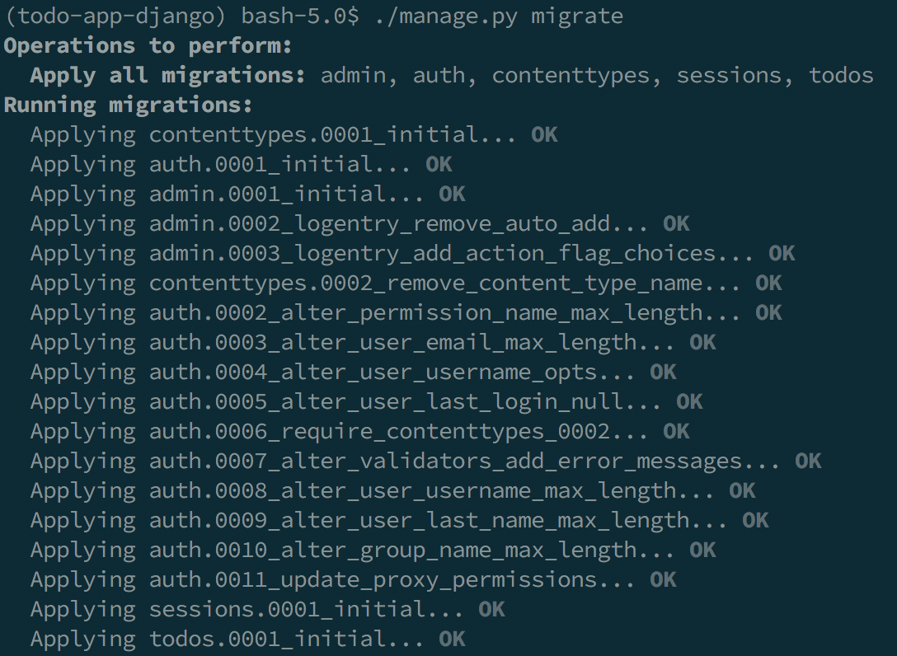
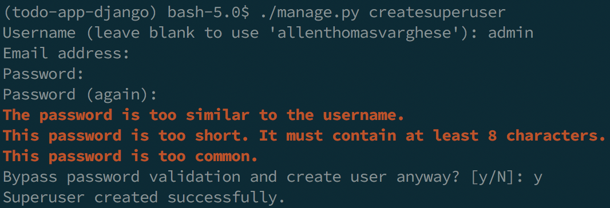
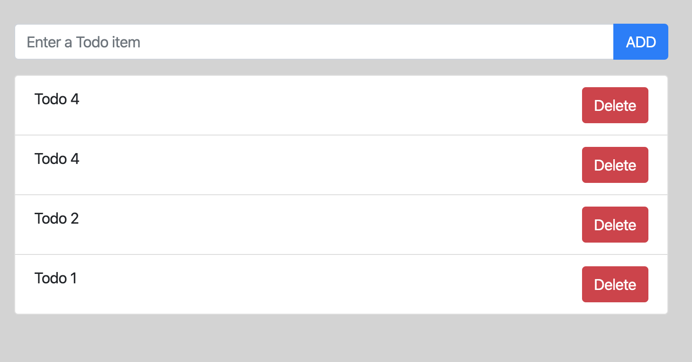
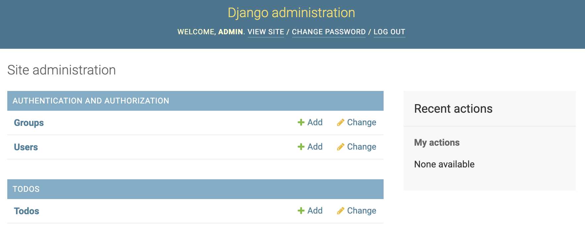

# todo-app-django

### Summary

A ToDo app created in Django that runs on your machine. You can add or delete todos

### Code Organization

The `todos` app contains the code for managing updates to todo items. The templates and styles for the webapp are available in this folder.

### Setup

This project requires `pipenv` to run. After you install it globally, run the following commands.

```bash
pipenv install --dev
pipenv shell
```

This will switch over to the `virtualenv` created by `pipenv`. You can verify this by checking the update to the shell prompt which will have `(todo-app-django)` at the beginning.

Next step is to create the local database. For that you will have to run the database migrations. Execute the following commands to create the required tables in SQLite database.

```bash
cd todoapp
./manage.py migrate
```

You should see something like the below:


Create an admin user for accessing the administration dashboard. Use the default settings with user name and password both set to `admin`

```bash
cd todoapp
./manage.py createsuperuser
```

The steps are shown below:


The application setup is now complete. You can start the application by running `./manage.py runserver`. This will start a development web server at `http://localhost:8000/` which you can access via a web browser.



The admin dashboard can be accessed at `http://localhost:8000/admin/`. Enter `admin` for both user name and password (created before)



### Reference

Below YouTube videos were very helpful:

- https://www.youtube.com/watch?v=phHM6glUURw
- https://www.youtube.com/watch?v=4YDwhpahLvc
